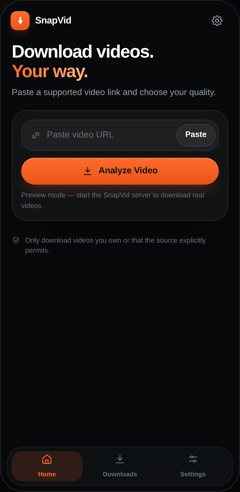
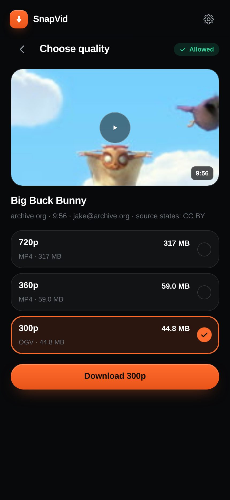
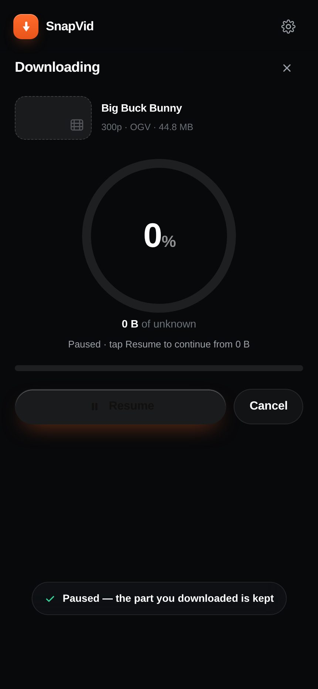
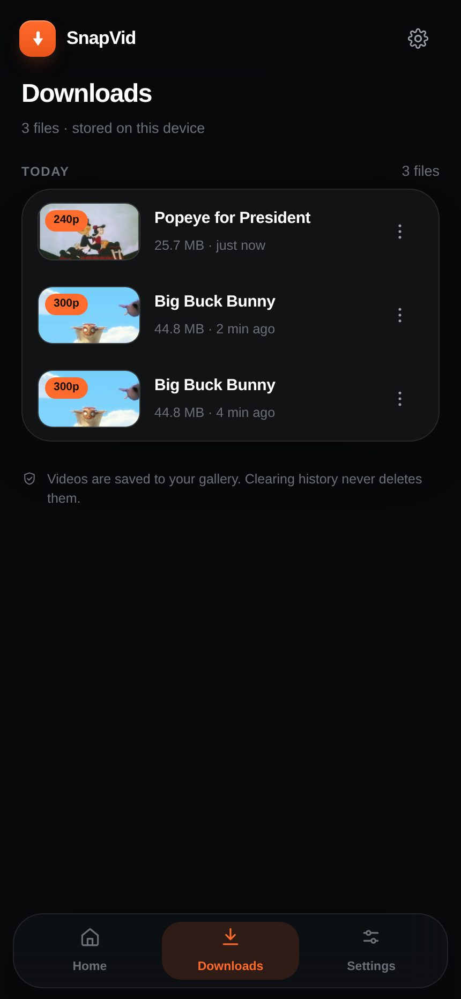
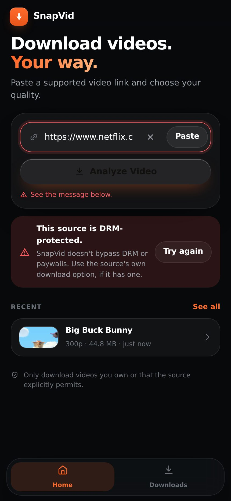

# SnapVid

**Save your favorite videos, simply.**

A simple, premium video downloader: paste a supported link → pick a quality → watch it download.
Mobile-first, dark and light, works on iPhone, Android, tablet and desktop.

It works in two ways:

| | |
|---|---|
| **With the server** (real) | Paste a link and SnapVid actually resolves the video and downloads the file. Real title, real thumbnail, real sizes, real pause/resume. |
| **Without the server** (preview) | The same interface runs standalone — self-contained, offline, no install. Nothing is downloaded; the hint line says so. |

```bash
git clone https://github.com/gmrony135/snapvid
cd snapvid/server
npm start                 # → http://localhost:8787   (needs python3 + yt-dlp + ffmpeg)
```

<p align="center">
  
  
  
  
  
</p>

Those captures are real runs against the server: real links, real files, a real refusal.
More in [`assets/screens/`](assets/screens) (`live-*.jpg`) — including the completion screen and a second source.

---

## The server (what makes it real)

No dependencies — plain Node.js, standard library only. It needs two external tools:

```bash
pip install yt-dlp        # the download engine
sudo apt install ffmpeg   # merges video+audio, extracts audio tracks
```

Then:

```bash
cd server
node check.js                                    # doctor: engine, policy self-tests
node check.js https://archive.org/details/BigBuckBunny_124   # ...plus one real download
npm start                                        # → http://localhost:8787
```

Open **http://localhost:8787** — the server serves the app itself, so nothing else to run.

### API

| | | |
|---|---|---|
| `GET` | `/api/health` | engine versions, policy settings, active downloads |
| `POST` | `/api/analyze` | `{url}` → real title, uploader, duration, thumbnail, licence, qualities with sizes |
| `POST` | `/api/download` | `{url, quality}` → a job (re-checks the policy before it starts) |
| `GET` | `/api/jobs` · `/api/jobs/:id` | history · live progress (percent, bytes, speed, ETA) |
| `POST` | `/api/jobs/:id/pause` · `/resume` · `/cancel` | pause keeps the partial file; resume continues it; cancel deletes it |
| `GET` | `/api/file/:id` | the finished file, Range-capable (streams, seeks) |
| `DELETE` | `/api/file/:id` | delete file + record |

### Settings — `server/config.json`

| Key | Meaning |
|---|---|
| `allowedHosts` | `[]` = accept any source the engine supports. Fill it (e.g. `["archive.org", "vimeo.com"]`) to lock this server down to sources you're allowed to use. |
| `maxQualityHeight` | Highest resolution offered in the quality list (default 1080). |
| `maxDurationSeconds` | Refuse anything longer (default 4 hours). |
| `maxConcurrentDownloads` | How many downloads run at once (default 2). |
| `apiToken` | Optional. When set, the API needs it — open the app once as `/?token=…` and the browser remembers it. **Do this before putting the server on the internet.** |
| `cookiesFile` | Optional, off by default. Only for sources where *you* are authorised. SnapVid never logs in for you. |

### Use it from your phone (same Wi‑Fi)

The server listens on `0.0.0.0`, so it's already reachable on your local network — no deploy needed:

```bash
hostname -I            # find your computer's IP, e.g. 192.168.0.20
```

Then open `http://192.168.0.20:8787` on your phone. On iPhone/Android, use **Share → Add to Home Screen**
and it behaves like an app (safe-area aware, no browser chrome). Downloads land in your device's
Downloads; tap **Share** on the completion screen to move one into Photos.

### Put it online

Anything that runs Node works (Render, Railway, Fly.io, a VPS…). Install `yt-dlp` + `ffmpeg` in the
build step, set `PORT`, mount a volume for `server/downloads/`, and **set `apiToken`** — otherwise
anyone who finds the URL can use your server, and the files stay listed in `downloads/`.

---

## The product rule

SnapVid only processes videos you're authorised to download or that the source explicitly permits.
It does **not** bypass DRM, paywalls, logins or platform download restrictions, and it never asks for
your passwords or cookies to work around one. Sources like Netflix, Prime Video, Disney+, Spotify and
course platforms are refused up front, and the refusal is enforced **on the server**, so no client can
skip it. The UI states this, the server enforces it, and the tests check it.

---

## Getting the file into your phone's gallery

A web page can never write to Photos/Gallery silently — iOS and Android don't allow it. SnapVid
therefore does what *is* allowed, and says so honestly:

- **Web Share API** (already wired) — after downloading, tap **Share** and choose *Save to Photos*.
  On mobile Safari/Chrome the file goes straight into the gallery from there.
- **Native shell** — wrap the same UI in [Capacitor](https://capacitorjs.com) and save through
  `PhotoKit` (iOS) / `MediaStore` (Android) to land in the gallery with no share sheet. Same HTML,
  no redesign.

The app never claims the file is already in Photos: in live mode the completion screen reads
*"Your device — tap Save/Share for Photos"*.

---

## The app

There is **no settings screen** — the app has two destinations, Home and Downloads. The theme follows
the device automatically (dark/light), so there is nothing to configure: quality is chosen per download,
and the file's destination is decided by your browser/OS, not by a preference.

`index.html` is the whole interface — one self-contained file (CSS, JS, icon inlined), no build step.
It carries the live layer in a separate block at the bottom (`live.js`, inlined by
`node design-system/tools/inline-live.js` so the file stays self-contained). If no server answers, the
block stays dormant and the app is a plain preview — nothing is faked, and the hint says
*"Preview mode — start the SnapVid server to download real videos."*

It ships **empty**: no sample titles, no placeholder videos, no demo history. Everything you see comes
from the link you paste or the files you actually download.

| | |
|---|---|
| **Home** — hero, URL field (paste / clear), `Analyze Video`, recent downloads | **Choose quality** — one row per resolution the source really has, with real sizes and a checkmark |
| **Downloading** — progress ring, %, MB done of total, speed, ETA, `Pause` / `Resume` / `Cancel` | **Complete** — animated check, quality + size summary, `Open` / `Share` / `Download another` |
| **Downloads** — Today / Yesterday / Older, row menu: Save, Open, Copy link, Delete | **Theme** — the app follows your device, dark and light, no settings screen |

19 captures: 12 of the interface, 7 from real runs — [`assets/screens/`](assets/screens).

---

## Auto-push (this repo pushes itself)

Every commit made in this repo is pushed to GitHub automatically by a `post-commit` hook:

```bash
./sync.sh --status          # local vs GitHub, and what's uncommitted
./sync.sh                   # push now (usually not needed — the hook does it)
./sync.sh --install-hook    # re-install the hook if .git/hooks is ever lost
```

How it works:

- `tools/git-hooks/post-commit` (installed into `.git/hooks/post-commit`) calls `sync.sh` after each
  commit. It never blocks a commit — if the push fails it is logged and the commit stays local.
- The token is read from `.snapvid-token` (untracked, `chmod 600`, listed in `.gitignore`) or from
  `$GITHUB_TOKEN`. It is never written into `.git/config` and never printed.
- `sync.sh` also restores the git identity and the `origin` remote if a fresh clone of this workspace
  lost them, so the hook keeps working.
- Failures land in `.git/autopush.log`; run `./sync.sh` again when the network or the token is back.

**Keep it safe:** use a **fine-grained** token limited to this one repository with only
*Contents: Read and write*, and an expiry date. To rotate it, overwrite `.snapvid-token` and delete the
old token on GitHub. To stop the automatic pushes, remove `.git/hooks/post-commit`.

## Project layout

```
index.html              the app — single file, self-contained
live.js                 the block that connects it to the server (inlined into index.html)
server/                 the real backend — plain Node.js, no dependencies
  server.js             API + static app + file streaming
  lib/engine.js         yt-dlp wrapper (analyse, progress template, pause/resume/kill)
  lib/policy.js         the guardrails: what SnapVid refuses, and why
  lib/jobs.js           job manager: progress, pause/resume/cancel, restore after restart
  check.js              doctor + policy self-tests + optional end-to-end download
  config.json           your settings (allowed hosts, limits, token)
assets/
  screens/              screenshots (interface + live runs)
  brand/                app icon: dark / light / accent, 16→1024 px, SVG marks, iOS + Android assets
design-system/          the earlier full 13-screen design system + test/screenshot tools
LICENSE                 MIT
```

### design-system/ (optional)

The first pass at this brief — an interactive studio: 13 screens across iPhone / Android / tablet /
desktop, dark + light, error and empty galleries, a live brand style guide, and the test pipelines.
The settings screen that used to live here was removed as well, so the studio, the gallery and the
standalone prototype all match the app again: 12 screens, two destinations, no settings.

```bash
cd design-system
npm install
npm test                      # 106 smoke checks (jsdom)
node tools/test-simple.js     # 56 checks — the app's interface
node tools/test-live.js       # 23 checks — a real download through the real UI (needs the server)
node tools/shots-simple.js    # interface screenshots → assets/screens/
node tools/inline-live.js     # re-inline live.js after editing it

# test-live.js writes its captures to design-system/preview/ (ignored) so a run
# never dirties the repo. To refresh the committed ones:
SHOTS_OUT=assets/screens node tools/test-live.js        # (repo-root relative)
```

---

MIT licensed.
