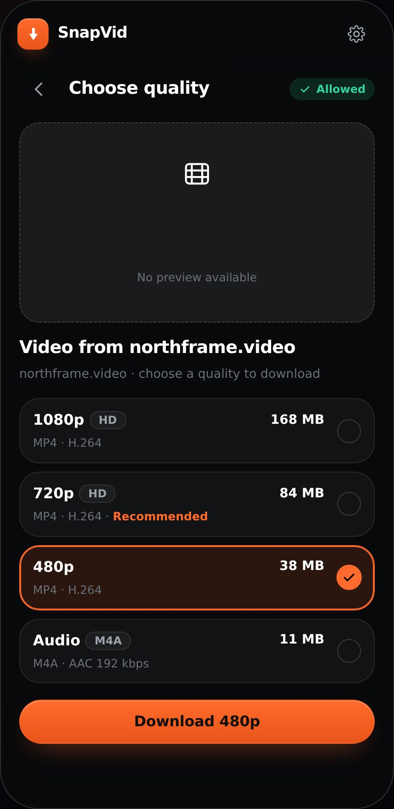
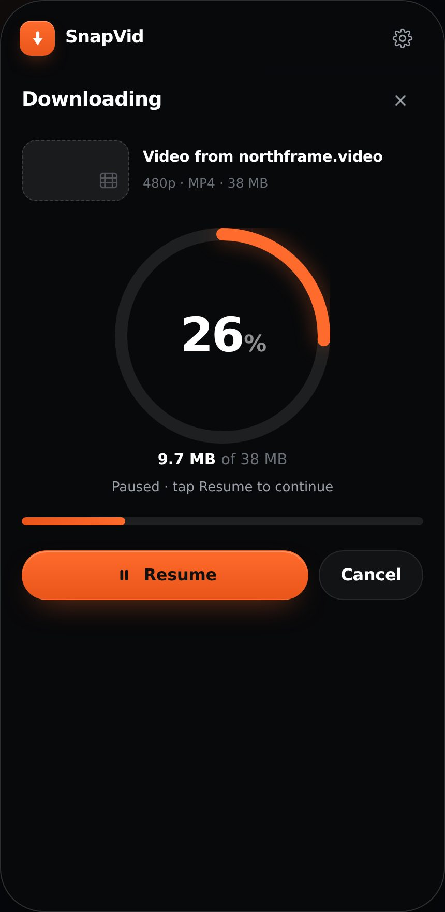
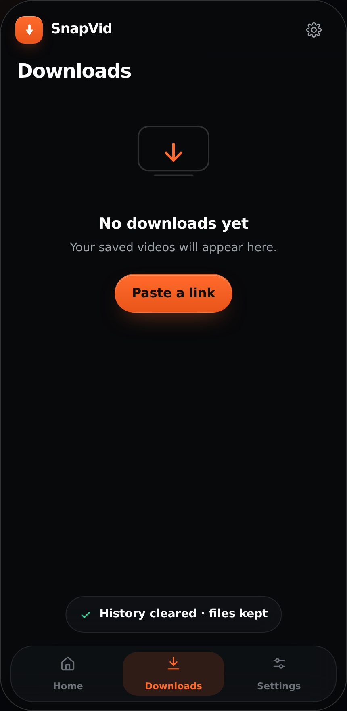

# SnapVid

**Save your favorite videos, simply.**

A simple, premium video-downloader UI — one self-contained HTML file, no build step, no dependencies.
Paste a supported link → pick a quality → watch it download. Dark and light themes, mobile-first,
works on iPhone, Android, tablet and desktop.

<p align="center">
  
  
  
  
</p>

## Run it

Just open **`index.html`** in any browser. That's the whole app — one file, ~55 KB, works offline.

It ships **empty on purpose**: no sample titles, no placeholder videos, no demo history. You paste (or type)
a link, and everything you see afterwards — the video name, the file sizes, the download list — comes from
that link and from what you actually download.

Prefer a server?

```bash
python3 -m http.server 8000
# then open http://localhost:8000
```

## Screens

| | |
|---|---|
| **Home** — hero, URL field (paste / clear), `Analyze Video`, recent downloads | **Choose quality** — 1080p · 720p · 480p · Audio, with file sizes and a checkmark on the selection |
| **Downloading** — progress ring, %, MB done of total, ETA, `Pause` / `Resume` / `Cancel` | **Complete** — animated check, quality + size summary, `Open` / `Share` / `Download another` |
| **Downloads** — grouped by Today / Yesterday, row menu: Open, Share, Delete, and a friendly empty state | **Settings** — Dark / Light / System, default quality, Wi‑Fi only, clear history, privacy note |

More screenshots: [`assets/screens/`](assets/screens) — 14 captures in dark and light, including the empty
and error states.

## Try this

1. Paste a link (**Paste** reads your clipboard) or type one, then **Analyze Video** — watch the staged
   check: reading → permission → formats.
2. Pick a quality — the button label follows your choice.
3. **Download** — pause and resume it, or cancel and go back.
4. Leave the field empty, or type `netflix.com/...`, and analyze → see the error states.
5. **Downloads** is empty until your first download finishes; **Settings → Clear download history** empties
   it again (your files are untouched).

## Product rule

SnapVid only processes videos you're authorised to download or that the source explicitly permits.
It does **not** bypass DRM, paywalls, logins or platform download limits — links without download
rights get a clear, actionable message instead. This rule is reflected in the UI itself, not just the docs.

## Project layout

```
index.html              the app — single file, self-contained (CSS, JS, icon all inlined)
assets/
  screens/              14 screenshots (used in this README)
  brand/                app icon: dark / light / accent tiles, 16→1024 px, SVG marks, Android + iOS assets
design-system/          optional: the earlier full 13-screen design system, interactive studio + style guide
LICENSE                 MIT
```

### design-system/ (optional)

The first pass at this brief — a bigger, interactive design studio: 13 screens across iPhone / Android /
tablet / desktop frames, dark + light, error and empty state galleries, a live brand style guide, design
notes per screen, and a Playwright screenshot pipeline. Open `design-system/index.html` in a browser, or
`design-system/snapvid.html` for the standalone prototype.

```bash
cd design-system
npm install
npm test                  # 106 smoke checks (jsdom)
node tools/test-simple.js # 32 checks for the simple app
node tools/shots-simple.js
```

---

MIT licensed. SnapVid is a design concept: sample videos, creators and file sizes are fictional, and
thumbnails are original generated imagery.
